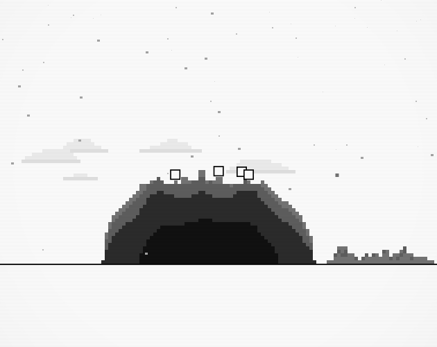
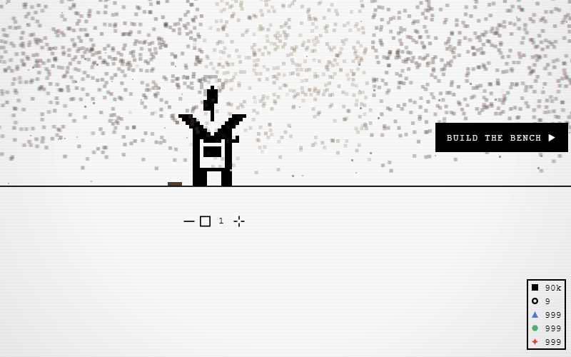

# Pebble Pit

A black-and-white pixel clicker about a rock, a hole and the people between
them.

**[Play it in the browser](https://cameldash.itch.io/pebble-pit)** · [Desktop
builds](https://github.com/asg86260/pebble-pit/releases/latest) · [What
changed](CHANGELOG.md)

Click the rock. Throw what comes off it into the hole. Hire somebody to do that
for you, then somebody to feed them, then somebody to sweep up after the
machines. Watch the sky get worse. Decide whether to do anything about it.

Black and white, six grays, everything on a six-pixel grid. There is no music —
you hear the yard, not the game. It runs while you watch it and stops when you
don't, and it never ends.

---

## The one underneath

It starts before the rock, and it starts close. Two squares stand on bare
ground with the view pulled right in on them, talking in the same dots two
bodies pass back and forth on a break, and every so often one of them says the
other thing: a heart. That is the whole vocabulary this game has for people
getting on, and it is enough.

Then a boulder comes down out of the sky on one of them. The other is thrown
clear, lands flat on its back, lies there in the only silence in the game, gets
up with an exclamation mark over its head, and starts digging. The view pulls
back out while it does, and by the time it is out you are playing.

Everything after that is one body trying to get its mate out. The first rock
drove them into the ground to their middle, and there they are lodged. Every
time the last of a rock goes you can see them down there, sunk in the ground
line, saying the same dots; whoever is nearest runs over and digs, and they
come up a little. And every time, before they are out, the next rock lands and
drives them back in. That is what the crew is for, what the pit is for, and why
the rocks keep coming.

## Nothing teleports

Every body walks to every destination. Nothing pops in, nothing pops out,
nothing appears where it is wanted. A number that changes without a body
crossing the yard would break the one thing that makes this read as a works with
people in it rather than a spreadsheet with a picture on top.

So the pile in the pit *is* the dust, not a picture of it: one grain is one
dust, drawn the same size as dust anywhere else. Buying something lifts grains
back out of the hole and you watch them fly across to the shop that sold it. A
station's output depends on who is actually standing in it, never on who was
assigned. The scrubbing house with nobody in it is a shed. The lab's research
bar does not move while the lab is empty. And the sky is not a cloud sprite: it
is every mote that climbed off a swing, arrived, and stayed.

## The world runs off to the left

Every site stands on one ground line. You start with the rock, the bench and
the pit, and the ground to the left is empty until something is built there —
walking further out *is* the tech tree. The quarry is an open cut you can watch
the crew work the floor of; the farm is a row of plots that only grow while
somebody is tending one; the lab is a block with a chimney; the tower calls a
star down out of the sky and makes wizards to work it; the casino is the last
thing on the ground, the longest walk, on purpose, for the one place that makes
nothing.

Color arrives slowly and only where it means something. The ground is always
gray, because gray is how deep the rock was and that is the only thing it is
allowed to mean. The first color is what the sites give up: a shard never came
off the rock, so it can be blue; a spore grew, so it is green. Red is for the
machines, and for the one thing in the yard that is plainly magic acting on
something plainly dirt. Purple is what magic looks like when it moves.

Every building has the same door — four cells across, four courses tall — because
a door is the one part of a building measured against a person rather than
against the building. It is what tells you how big the rest of it is.

## Everybody is somebody

A body has a name, an age, and a record of what it has shifted: rock taken,
finds brought up, grains tipped into the hole, where it has spent its time.
None of it does anything. There is no number on that card that feeds a rate,
and there never will be, because the moment one does the crew stop being people
and become a spreadsheet with faces. It is there so that the four on the rock
are four people rather than the number four.

You can pick one up. Hold the right button, lift a body, carry it, drop it
somewhere. It does not put them on a job and it does not take them off one;
whoever you drop walks back to whatever they were doing, from wherever you left
them. Dropping one down the far end of the yard is a body with a long walk ahead
of it, which is the entire joke and the entire point.

A body with nothing to do takes a break, and most of the time nothing happens
at all. About two turns in three come to nothing, and what makes a cigarette
worth noticing is that the last four times you looked over there, nobody was
having one. A note over the head is singing, a burst is swearing, dots are
talking — and dots going back and forth between two bodies who have turned to
face each other is a conversation, which you read off the pair rather than off
either of them. The janitor always smokes.

When a rock comes off, the whole yard stops what it is doing and dances.

## The sky gives it back

Every grain taken out of the ground puts a mote of it into the sky — off the
rock, up out of the cut, off a plot being turned. Nothing carries them away.
They gather, lean toward each other into banks that were never placed, thicken
into a band over the yard, and past a point the sky gives the lot back at once.

This is the only thing in the game that makes the works worse, and it is caused
by the one thing you do most. That is the point of it. The yard should not be a
machine that only ever goes up.

The answer is a building with somebody in it. The scrubbing house pulls a
thread of cells out of the nearest cloud and down the funnel in its roof, and
the cost of clean air is a body not on the rock — a decision you can take back
whenever you like. The machines out-foul a bare house several times over and
never stop, so a yard that buys its third machine has bought a sky it cannot get
back down until it invests in the house. Ignore it and it rains on you. Buy into
it and it comes under control. It never goes permanently clean; the sky is meant
to stay a live decision.

## Every upgrade changes what happens

An upgrade here is a new worker, a new machine, a new place — behavior, not a
bigger multiplier. Where a ladder exists it has an end and the row says where
you are on it: `strength 3/5`. Running a ladder dry is not a wall. It is the game
telling you where to go next.

Time is a price like the rest. Everything past the bench takes the yard's time
to build, and while the cut is going down a bench it is not doing anything
else, so you had to decide that was the thing worth building. The waiting is
what makes the choice a choice.

Each currency has one job. Dust scales what you have. Cores — the white circle
buried at the center of every rock, hidden until you dig down to it — open what
you don't. Shards and spores multiply the whole operation. Sparks, the game's
only red, buy the machines and every rung of their ladders, and those ladders
never end: the largest purchase in the game is the start of a line, not the end
of one.

## The shields are the spine

The rocks keep coming, and the yard keeps trying to stop one. Each shield is
bought, fails, and hands you the next — and each failure opens a door. Timber
props do not slow it, so you need a better coin than dust: the farm. A rope net
catches and does not hold, so you need something harder than the ground grows:
the quarry. A stone arch cannot hold rock, so nothing of the ground will: the
tower, and a wizard. The dome is the wizards', the first shield not made out of
the ground, and it is not built but summoned. It is the one thing in the yard
you save for.

The story is not optional, because the story is the tree.

## The hole

The pit is the working floor, not the vault. For a long time it holds every
grain as a drawn cell, and it fills. The first time it cannot take one more, a
small hole tears above the mouth and starts eating — and grows with what it
eats, inhaling whatever is in its reach. When it has eaten enough it collapses
down into the pit and the pit liquefies: an abyss standing in the hole, and from
then on the liquid is what takes. Nothing is lost. The counters read what you
own; the pile shows what is in the hole; what is through the rift is somewhere
else.

## No ending

Rocks keep coming, each a little bigger than the last until they plateau,
because something that grew forever would fill the sky. There is no fail state,
no timer, no losing dust, no punishment for walking away, and nothing is ever
taken away to make you start again.

What changes over a run is the shape of your attention. Early on you are
swinging. By the middle you are choosing who to hire and where to put them. By
the end you are watching a yard that runs itself and deciding what it should do
faster. You'll know when you're done.

---

## Playing it

The browser version on itch is the game. Your save lives in that browser and
autosaves every second; `save a copy` on the pause sheet (`esc`) puts it on
your clipboard and `load a save` takes it back — do that before you clear site
data or change machines. Sound is on and quiet, and browsers allow neither sound
nor keys until you click once.

The desktop build is the same game as a Windows app: the save becomes a file
with a backup beside it, the window remembers where you left it, `F11` goes full
screen. It is unsigned, so Windows will protect your PC the first time — *More
info → Run anyway*. It is 110 MB for a 300 kB game; the rest is Electron. Sorry
about that.

## Running it from source

Vite and vanilla ES modules on one canvas, no framework, no runtime
dependencies. `bun install` and `bun run dev` serve it on 5183; `play.html` is
the game and `index.html` the landing page. In a dev build the backtick opens a
panel with every number worth arguing with, live, because that is how they were
found.

`ARCHITECTURE.md` says which file owns what. `DESIGN.md` carries the reasoning
behind every feature, built or not — most of what is written above is lifted
from it. `TODO.md` is the open work with its diagnosis. `CLAUDE.md` is the
working agreement for anyone, or anything, changing the code, including how the
two test tiers are run and why a picture is the check for anything drawn.
`bun run release -- patch` cuts a version; the tag builds everything on GitHub's
runners and pushes it to itch.

Made by Andrew Graham. Free; the tip jar is on itch.
